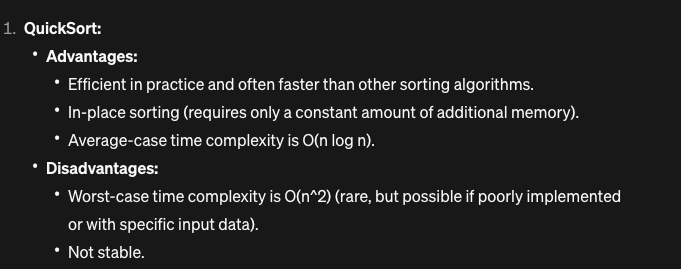
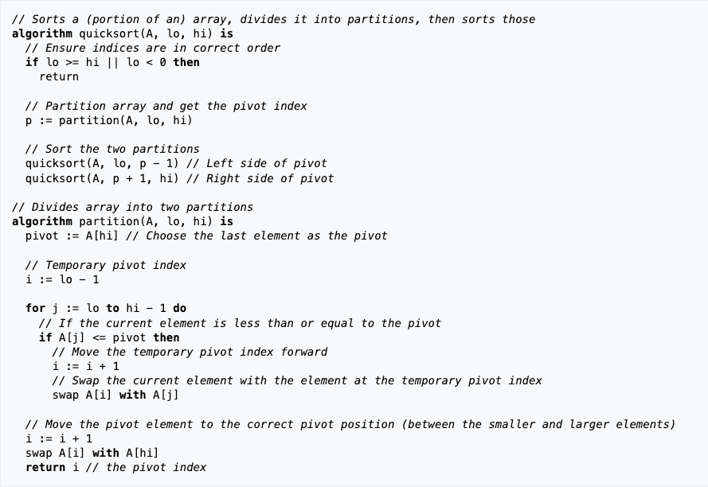
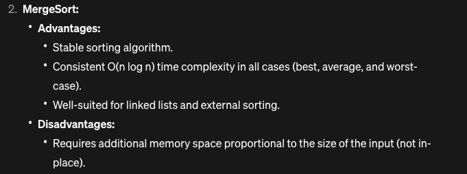
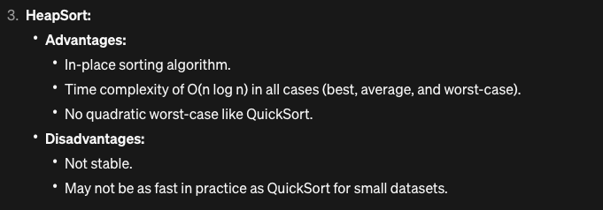
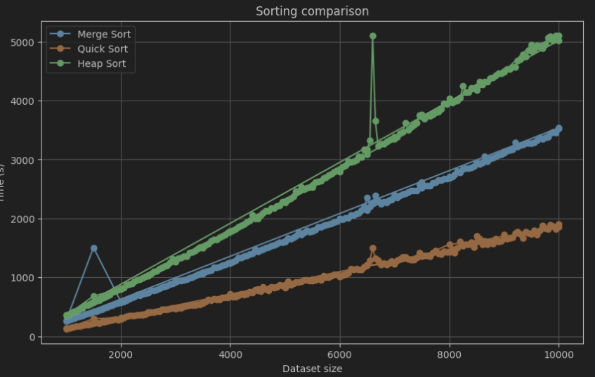

# About this repo

Project with 3 sorting algorithms, heap merge and quick sort

# Sorting algorithms 

Information taken from `chat.openai.com`

## Quick sort




## Merge sort



### Explanation time complexity


## Heap sort



---

# Python version
Python 3.11.0

# Running locally and testing

```
virtualenv env
source env/bin/activate
pip3 install -r requirements.txt
```

# Check coverage

Make sure you have "coverage" in your requirements.txt file and run pip install. Then run `coverage run -m unittest discover` and after that run `coverage report` to get the following table:

```shell
Name                           Stmts   Miss  Cover
--------------------------------------------------
base/__init__.py                   0      0   100%
base/test/__init__.py              0      0   100%
heap/__init__.py                   0      0   100%
heap/algorithm.py                 19      0   100%
heap/test/__init__.py              0      0   100%
heap/test/test_algorithm.py       11      1    91%
merge/__init__.py                  0      0   100%
merge/algorithm.py                23      4    83%
merge/test/__init__.py             0      0   100%
merge/test/test_algorithm.py      11      1    91%
quick/__init__.py                  0      0   100%
quick/algorithm.py                19      0   100%
quick/test/__init__.py             0      0   100%
quick/test/test_algorithm.py      11      1    91%
utils/__init__.py                  0      0   100%
utils/constants_test.py            2      0   100%
--------------------------------------------------
TOTAL                             96      7    93%
```

# Code beautifier
This code has been beautify using black: https://github.com/psf/black. 
The command to use is `black . -l 120`.

# Sorting performance


